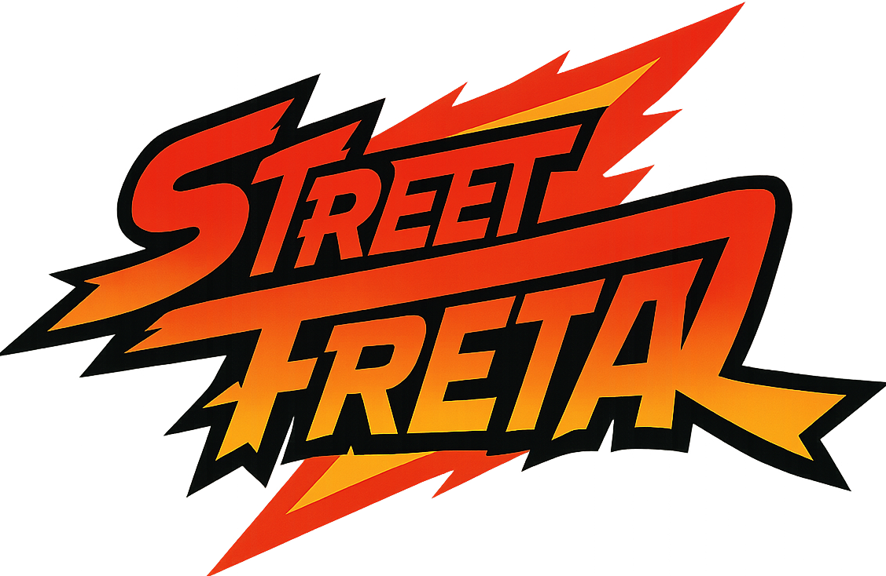

### 1 INTRODUÇÃO
O presente relatório descreve o processo de desenvolvimento do projeto "Street Treta", uma aplicação web do tipo Landing Page desenvolvida como requisito parcial para a disciplina de Interação Humano-Computador. O projeto consiste em uma interface temática que simula a seleção de personagens e eventos de um jogo de luta fictício, utilizando uma estética "Arcade/Retrô". O objetivo principal do trabalho foi aplicar, de forma prática e integrada, os conceitos fundamentais de desenvolvimento Front-End, englobando a estruturação semântica com HTML5, estilização avançada e responsiva com CSS3 e a implementação de lógica de interação e manipulação de dados via JavaScript.

### 2 METODOLOGIA E FERRAMENTAS
Para a construção da aplicação, adotou-se uma abordagem de desenvolvimento baseada em padrões web modernos, sem o uso de frameworks pesados, visando o domínio da linguagem nativa. Foram utilizadas as seguintes tecnologias:

* **HTML5 (Hypertext Markup Language):** Utilizado para a estruturação semântica do conteúdo, dividindo a página em seções lógicas. Destaca-se a implementação de múltiplas páginas interligadas e o uso de tags multimídia (`<video>`) para exibição de conteúdo audiovisual.
* **CSS3 (Cascading Style Sheets):** Empregado para a definição do layout visual. Destaca-se o uso de Grid Layout para o posicionamento dos cards, Flexbox para o alinhamento de menus e variáveis CSS (`:root`) para o gerenciamento eficiente da paleta de cores.
* **JavaScript (ES6):** Utilizado para a manipulação do DOM (Document Object Model) e gerenciamento de estados. O script foi responsável por criar um "banco de dados" local (Objeto JavaScript), capturar parâmetros de URL e renderizar dinamicamente o conteúdo das páginas de perfil.
* **Ferramentas de Apoio:** Google Fonts (tipografias Press Start 2P e Roboto) e editores de código (IDE).

### 3 DESENVOLVIMENTO E IMPLEMENTAÇÃO
O desenvolvimento foi estruturado em três camadas principais: estrutura, estilo e comportamento, com foco na escalabilidade do conteúdo.

#### 3.1 Estrutura Semântica e Multimídia
A aplicação é composta por duas páginas principais. A página inicial (`index.html`) atua como hub central, contendo o cabeçalho, banner principal (hero), seção de eventos e a grade de seleção de lutadores. Na seção de eventos, foi integrado um player de vídeo nativo HTML5 para exibição de destaques das lutas. A segunda página (`lutador.html`) foi estruturada como um template genérico, projetada para receber e exibir dinamicamente os dados (imagem, descrição e estatísticas) de qualquer personagem selecionado.

#### 3.2 Estilização e Design Responsivo
A identidade visual seguiu o tema "Dark Mode", utilizando tons de azul escuro (`#020024`) contrastando com vermelho e dourado. Para garantir a legibilidade e a estética "gamer", foi aplicada a fonte Press Start 2P em títulos e a fonte Roboto (ou variante pixelada em destaque) para textos descritivos. Um desafio técnico solucionado foi a sobreposição do conteúdo pelo cabeçalho fixo (sticky). A solução implementada foi a utilização da propriedade CSS `scroll-padding-top: 130px` no elemento html, garantindo uma navegação fluida via âncoras.

#### 3.3 Interatividade e Lógica de Dados
A interatividade evoluiu de simples alertas para um sistema de navegação robusto implementado no arquivo `script.js`. As principais funcionalidades desenvolvidas foram:

1.  **Estrutura de Dados:** Criação do objeto constante `fightersData`, que armazena as informações (nome, alcunha, golpe especial, imagem e descrição) de todos os 9 lutadores.
2.  **Navegação Dinâmica:** A função `openFighterPage(id)` redireciona o usuário para a página de perfil passando o ID do lutador via parâmetros de URL (Query String).
3.  **Renderização Condicional:** Na página de perfil, a função `loadFighterProfile()` captura o ID da URL, busca os dados correspondentes no objeto e preenche os elementos HTML automaticamente. Isso permitiu criar perfis individuais para todos os personagens usando apenas um arquivo HTML modelo.

### 4 CONCLUSÃO
O desenvolvimento do projeto "Street Treta" permitiu a consolidação de conhecimentos avançados em Front-End. Além da estruturação visual e responsiva, o projeto demonstrou a capacidade de integrar recursos multimídia (vídeo) e implementar uma lógica de programação funcional para manipulação de dados e navegação entre páginas. O resultado final é uma aplicação web interativa, visualmente coerente e que atende integralmente aos requisitos de um portal de esportes/luta.

### REFERÊNCIAS
* **GOOGLE FONTS.** Press Start 2P. Disponível em: https://fonts.google.com/specimen/Press+Start+2P. Acesso em: 04 dez. 2025.
* **GERAÇÃO DE IMAGENS E CONTEÚDO:** GOOGLE GEMINI.
* **MOZILLA DEVELOPER NETWORK (MDN).** Web technology for developers. Disponível em: https://developer.mozilla.org. Acesso em: 04 dez. 2025.
* **W3C.** HTML & CSS Standards. Disponível em: https://www.w3.org/standards/webdesign/htmlcss.

---

#### Projetinho feito em 2025 🤩